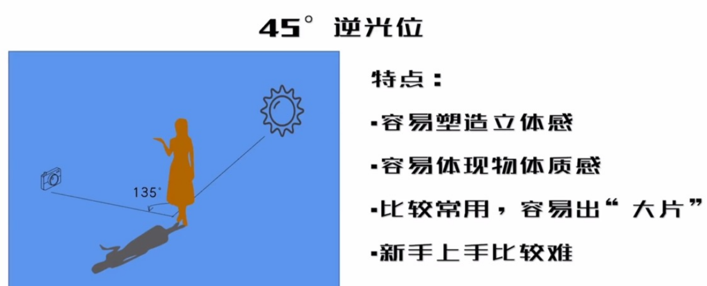
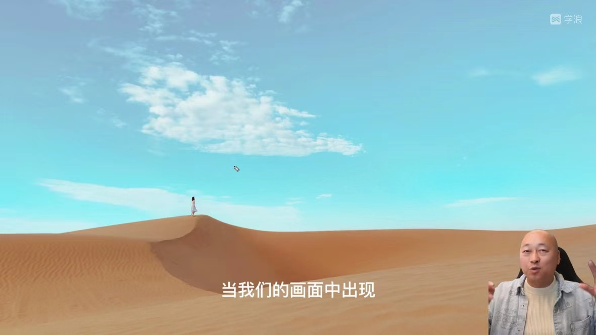

# 基础知识

## 审美

实现视觉审美需要的知识
- 让画面干净的方法
- 正确利用镜头和拍摄角度
- 正确和使用光线及色彩
- 正确是被人类的情绪、动作和眼睛表情
- 调度人物的情感和肢体
- 元素的属性、人、衣服和景的关系
- 光线色彩塑造氛围
- 镜头焦段对于空间感的建立
- 构图和景别的处理

## 人像

好看的人像主要由以下元素组成：
- 人
  - 抛开主观和片面的观点，重点关注表情是否自然，动作是否僵硬、衣服的特点和背景的风格是否匹配，镜头中高矮胖瘦的状态怎么样。
- 景物
  - 选景的时候先做减法再做加法，或者选择大面积的纯色，尽量避免一些杂乱的元素
- 光线和色彩
  - 什么样的场景选择什么样的衣服、该搭配什么样的颜色以及什么样的动作和表情

## 将人拍高拍瘦

将人拍高拍瘦和镜头畸变、透视、拍摄角度有密切关系。

### 透视
- 概念：近大远小，即只要人对着镜头越近，拍出来的越大，将人放在画面中心，会显得又短又矮。主要受广角镜头畸变所导致的。
- 现象：在中间1格是不畸变区域，自拍的时候将人脸集中到画面中心附近。

### 将人拍高

- 尽量要广角或者超广角镜头，同时将脚放在画面靠边的位置，头的上方尽量留下一格左右的空白。
- 将手机位于腰部以下拍摄。
- 贴着地面进行仰拍的时候，被拍的人稍微弯腰，让头和身体往前倾斜。

俯拍：从高往低拍，特点可以选择大量的地面元素作为背景，容易把人的腿拍的很短，常常使用半身照的拍法。

平拍：平行拍摄，如果拍全身照，尽量将手机位于腰部以下拍摄，同时将脚放在画面靠边的位置。

仰拍：从低往高拍，利用天空、建筑、或树林作为背景，适用于人山人海时拍摄。

## 如何摆动作

镜头感：镜头自然与否。

不要在乎镜头，不要因为小心而紧张，导致画面不自然。

所有的拍摄都不是完美的，拍出来的照片是素材，心理上不要有负担。

真正打动人心的情绪之美。没有人在乎身材和长相，更在乎的是表情真假。

- 选择一些服装道具、发型妆容、场景，匹配相应的风格。
- 注意自己的肢体语言和表情管理。

## 衣服颜色和风格选择

衣服颜色选择的基本原理：
- 背景颜色单一，衣服可以色彩多些
- 背景颜色复杂，衣服颜色要单一
- 颜色也要做减法，衣服和背景的主色不超过3种

风格分类：

- 清新唯美、自然舒适
  - 适合户外场景，浅色和白色系的衣服。
  - 如果是T恤或衬衣时，要搭一些半裙之类的。
- 复古、文艺
  - 适合复古类的场景，比如有年代感的校园，老旧的建筑小区、民宿院落等等
  - 衣服选择复古感比较强烈的衬衫、长裙、大衣等
  - 年龄比较小，选择校园装、睡衣等，年龄大的选择法式复古的长裙
- 古典优雅、宁静禅意
  - 适合古镇、中式园林之类的地方，衣服选择棉麻质地
- 另类和个性
  - 选择人物忧郁的时候，选择黑色的衣服，再配合一些破败成就的场景
  - 汉服和旗袍，选择荷花池、中式园林等场景

建议带上一件白色的长裙，适合任意场景

## 手机虚化背景理论

手机拍背景虚化
- 打开人像模式
- 手机和人的距离3米以内，1-2米之间效果最好
- 手机正确识别人脸
  
## 处理背景

人像五大景别：
- 远景
- 全景
  - 远景和全景特点：强调环境 人物是点缀
- 中景
  - 既强调人物也强调环境，人物占画面1/2或1/3，考虑背景的干净程度
- 近景
- 特写
  - 近景和特写特点：重点强调人物或细节，比片大头照，尽量使用居中构图，2-3倍长焦镜头

## 处理背景

想让照片变的好看，最有效的方法是做减法，关注背景是否简单和干净，背景干净的重点：
- 纯色
- 有规律
- 不拍（走近主体、前景遮挡）、少拍（不完整取景法）、弱化（虚化背景）与主体无关的元素

如何取景（找角度）：

移动相机、改变焦段、后期裁剪或者移动被摄对象，去除与主体无关的元素。

做到如下效果：
- 主体突出
- 主题明确
- 背景干净
  
元素重复出现就形成了规律，画面由不同的元素组成，包括：
- 颜色
- 形状
- 线条
- 材质
- 纹理

应对相对杂乱的背景，开启虚化

## 摄影的光线

光是摄影的灵魂。光线分为硬光和柔光。

硬光的特点：
- 照射在物体之上，被拍摄下来以后成像非常尖锐。
- 明暗反差强烈
- 容易还原物体的色彩

柔光的特点：
- 细节丰富，过度柔和
- 对比较低
- 色彩平淡，容易让画面偏灰

拍摄最佳的光线是介于硬光和柔光之间。

5种经典光位：
- 顺光位。光源在相机的同一方向。即光源、主体与相机夹角大概为0度。特点：
  - 缺少立体感
  - 又叫大平光
  - 容易记录丰富的色彩
  - 很少用到
- 45°测光位。光源、主体与相机夹角大概为45度。特点：
  - 容易塑造立体感
  - 容易记录丰富的色彩
  - 最常用
  - 新手也容易拍出好片
- 90°测光位。光源、主体与相机夹角大概为90度。特点：
  - 容易塑造立体感
  - 容易体现物体质感
  - 比较常用
  - 新手上手比较容易
- 45°逆光位。光源、主体与相机夹角大概为135度。特点：
  - 容易塑造立体感
  - 容易体现物体质感
  - 比较常用，容易出大片
  - 新手上手比较难
- 正逆光位。光源、主体与相机夹角大概为180度。特点：
  - 不易体现立体感
  - 容易塑造梦幻感
  - 控制光比可拍出剪影
  - 少数使用，新手上手难

示意图如下：

## 如何避免脸黑

大光比之下，手动调整曝光以后严重过曝。考虑面部亮度和背景亮度之间的关系。考虑光位，不要逆光拍。

## 剪影和阴天控光

逆光拍照的时候能够看到人脸、鼻子、眼睛的轮廓。

## 关于色彩需要知道的知识

色系分为冷、暖、中性三种。其中:
- 冷色系的代表颜色位青、绿、蓝。
- 暖色系的代表颜色为红、橙、黄。
- 中性色系的代表颜色为黑、白、灰、紫。

照片中如何运用颜色进行搭配：
- 使用反差色（冷暖色），黄色裙子和蓝色天空，蓝色毛衣和粉色樱花

冷色心理感受：
- 自然舒适
- 宁静清爽
- 优雅文艺

暖色心理感受：
- 热情激烈
- 大气时尚
- 复古怀旧

浅色心理感受：
- 简约舒适
- 高调明快
- 柔和安静

深色心理感受：
- 压抑神秘
- 低调厚重
- 深沉内敛

色彩的缩小与放大：
- 红色和大多暖色属于放大色，视觉上有膨胀感
- 黑色和一些深色属于缩小色，视觉上有缩小感
- 穿红色等容易显胖，黑色容易显瘦

色彩知识总结：
- 画面颜色做减法
- 颜色要有主次之分
- 人物和背景颜色要分离

## 善用色彩拍出美片

当画面中颜色较多的时候，使用黑白色进行处理，画面看起来会更有质感。

太阳落山半个小时是最佳拍摄时间，又被称为蓝调时刻。

## 手机中广角和长焦的特点

手机只有定焦镜头，利用镜头切换来实现变焦功能。
- 4-35mm被称为广角，手机上一般显示0.5x-1.2x
- 35-80mm被称为中焦，在手机上一般显示为1.2-3x
- 大于85mm被称为长焦，在手机上一般显示为大于3x的数值

广角镜头拍摄照片特点：
- 人和背景的感觉更远，放大了空间感。
- 不容易产生虚化背景
- 容易畸变，但是可以拍出大长腿

广角适合狭小空间内拍摄，会显得比较宽广，比如民宿图片。

## 构图

构图的目的让画面看起来更规则或者能够更加突出主体，强调风格和主体，构图的逻辑是先取景做减法，找到画面当中主要的元素
和适合做背景的元素。

人像构图方法分为黄金分割构图、居中构图、对角线构图、引导线构图、框架式构图、留白构图、对称构图、忘掉构图等

### 黄金分割构图

将人像放在画面当中的井字线上面，也被称为九宫格构图。

特点：
- 让画面更加自然、随意、和谐、舒适
- 产生一定的平衡美

适用场景:
- 居中构图时，物体和人物重叠
- 画面中有一些物体产生大面积延伸，留下表达空间

### 居中构图

将人像放在正中间.

特点：
- 更加正式和严谨
- 容易突出主体

适用场景:
- 表达严谨、严肃或帅气的情绪

### 框架式构图

在人物的周围会有一些边框。通过椅子的空洞遮挡杂乱的场景。

特点：
- 具有电影感
- 强调主体，避免杂乱
- 渲染照片氛围

适用场景:
- 具有框架式物体的场景

### 对称构图

左右或上下元素的形状对称。

特点：
- 严谨、庄重、大气、正式
- 强调规矩

适用场景：
- 建筑对称等

### 对角线构图

将主体放在画面对角的位置或画面由一些明显的线条切割了画面。

适用场景：
- 选择一些近景来遮挡杂乱的元素，强调主体
- 拍摄人物的时候，利用畸变，头放在中间，脚放在边缘。

### 引导线构图

画面中有一条或数条有形或无形的线，同时指向被摄主体。

特点：
- 可以塑造画面的空间感
- 让观众的视线被线条引导，强调主体

适用场景：
- 具有有形或无形线条的场景，比如栏杆、窗户等

### 留白构图

画面中具有大量的纯色色块、人物占比又非常小。

特点：
- 具有想象空间
- 用的相对较少
  
适用场景：
- 具有纯色色块的场景

### 忘掉构图

与前面的构图方式不同，无法定义构图。构图的最终方式，没有招式。

适用场景：
- 让画面干净，人物突出

## 人、景、衣服的匹配原则

观察人物本身的风格特点，比如气质古典、成熟优雅、时尚大气、清纯活泼。

衣服的类别：
- 休闲舒适：T恤、羽绒服，讲究舒适和功能性，不容易建立风格，容易生活化
- 都市化：西服、衬衫、风衣、大衣，显得干练、正式、现代、端庄
- 硬派：牛仔服、皮夹克等，适合旅行，帅气，个性
- 多变裙装：异域风情、波西米亚、复古怀旧、格子裙、清新淡雅、法式、欧式、大气时尚
- 秋冬天拍照最佳：纯色宽松毛衣，搭配半裙，帽子，围巾，包包，手套
- 运动服饰：卫衣、秋衣、练功服、瑜伽服
- 风格鲜明：旗袍、汉服、唐装、棉麻、禅意、古典、优雅、知性

景物分类：
- 自然元素：山川、河流、蓝天、白云、田野、沙漠、大海、植物等
- 人工元素：人造的场景，包含人文元素（具有一定的文化和艺术属性，比如老旧车站等）。

将人、衣服、景进行提取，找到关键的共通点（风格主题）。

风格分类：
- 清新
- 唯美
- 文艺
- 自然
- 复古
- 日系
- 怀旧

对人物、身材、衣服有一些要求的风格：
- 时尚
- 个性
- 性感
- 情绪
- 帅气

内心比较安静的人：
- 知性
- 优雅
- 古典
- 禅意

## 突出主体的方法

- 虚实对比
  

- 色彩对比
  

- 明暗对比

- 居中构图

- 引导线构图

