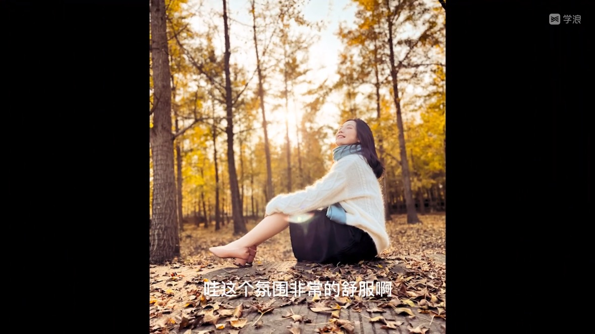
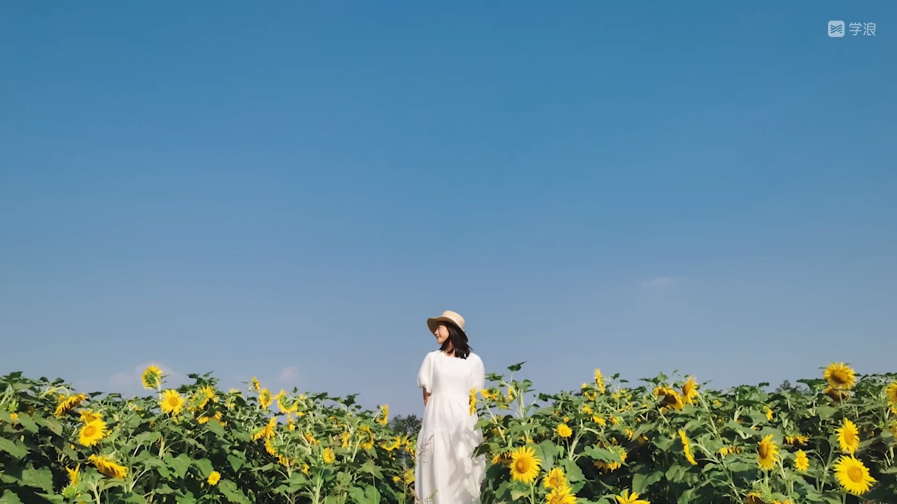
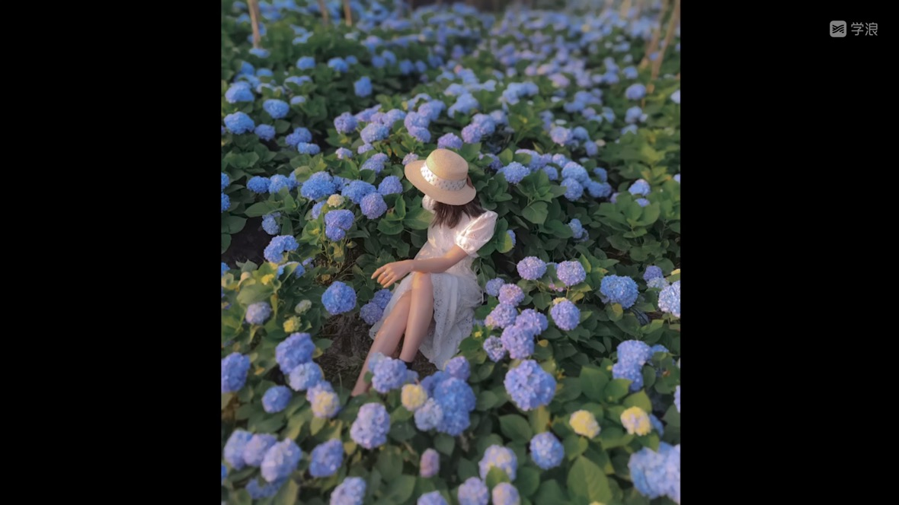
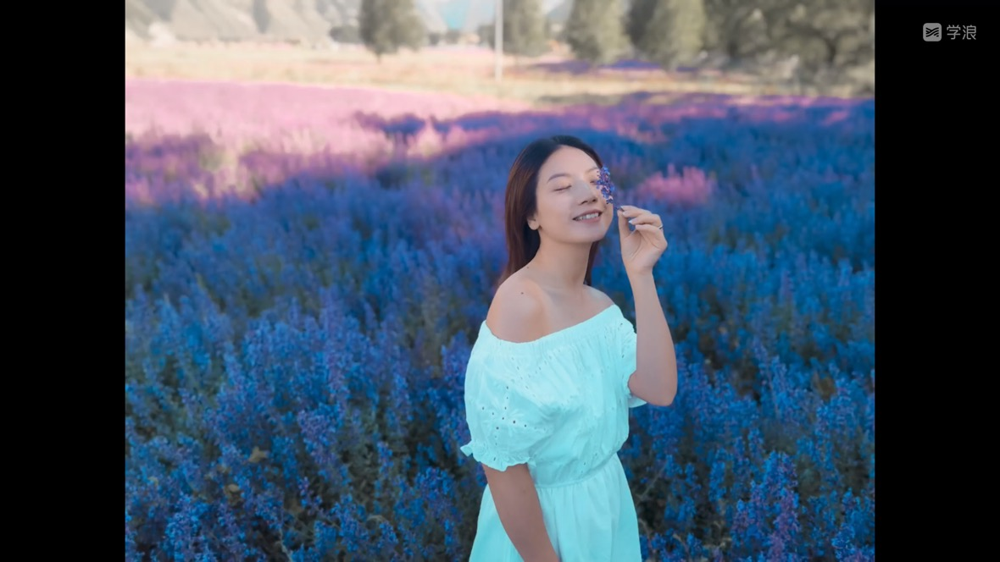

# 实战经验

## 逆光如何拍出唯美感

选择雨后天晴，非常通透的光线，时间选择在傍晚，太阳快要下山的一两个小时。

天空部分占1/3，控制画面中高亮区域的面积避免脸黑。高亮区域越高，人脸越容易变黑，高亮区域越少，人脸会变得越亮。

适合拍剪影，突出人物的轮廓和线条。

## 银杏的逆光和美资

## 银杏林的选景和美资

选择大面积落叶，没有杂草

## 剪影照片的操作细节

低角度拍，让人物的背后一定要有高亮的区域。让人物在运动中抓拍。

侧脸拍摄主要人物五官的轮廓线，拍摄最佳时机是太阳落山的前后半个小时

## 常见树林的选景和摆姿

草的色彩和线条相对单一，衣服选择上面略有风格。

## 向日葵拍摄

### 技巧1

白色长裙不挑年龄，而且清新唯美

### 技巧2

注意太阳角度，逆光容易把脸拍黑

### 技巧3

整曝光补偿，人脸正常但天空丢失细节

### 技巧4

顺光拍摄，皮肤通透，天空色彩很美

### 技巧5

选择低矮的花做前景，高的向日葵做背景

### 技巧6

人像模式，识别人脸虚化背景

### 技巧7

怼进花花做前景，避免杂乱，营造虚化

### 技巧8

找好看的花挡脸拍摄，脸更小

### 技巧9

低角度仰拍，天空做背景，画面极简

### 技巧10

远景拍摄，顺光拍天空又蓝又干净

## 绣球花的拍摄角度和美姿

服装：白色连衣裙+草帽

天气：充满斜斜的阳光

## 薰衣草的拍摄角度与美姿

动作怎么摆?

符合年龄的才是好动作

、

