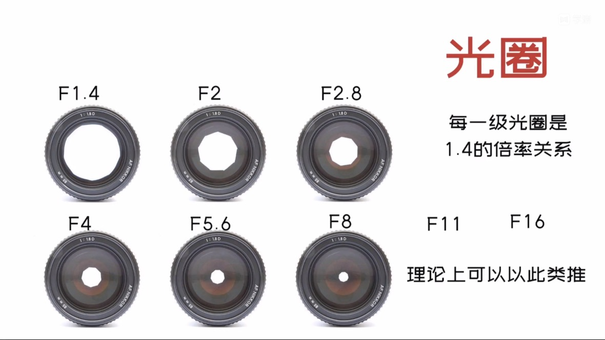
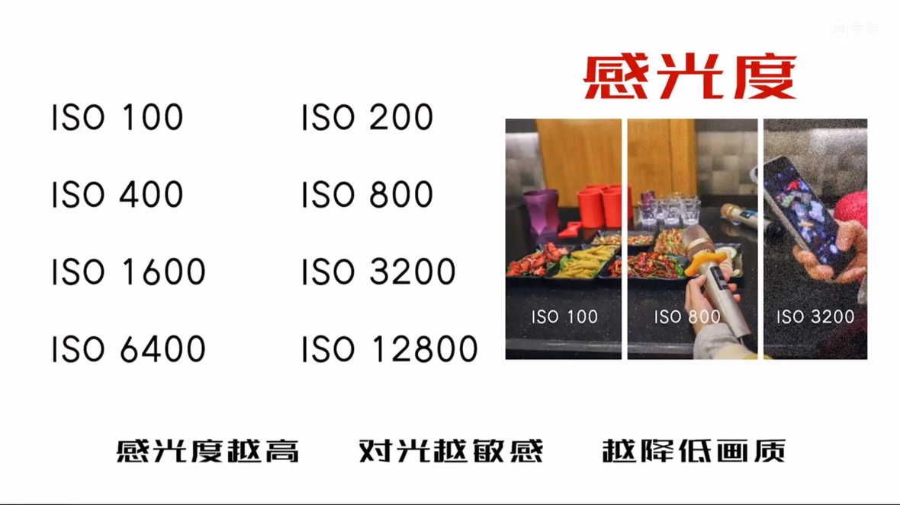
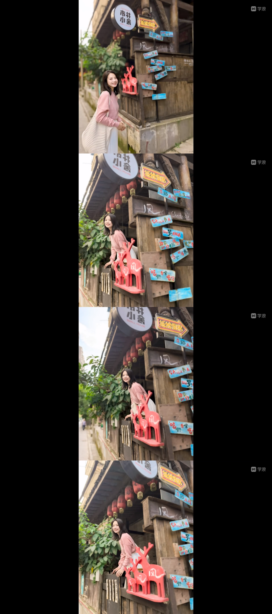

# 风光静物和常见问题

## 摄影的类别和审美

生活中日常拍摄的类别可以分为：
- 人像
- 风景
- 静物
- 生态
- 纪实

人像分为纪实人像和风格人像。

纪实人像的审美要求是尽可能的还原事实，用照片讲述故事，不用过多地去注重光影和色彩，但要尽量灵活的运用取景和构图。
关注点是机位和角度，组合人物和环境的互动。难度较高。
- 真实为主，尽量减少对被拍者的影响
- 反应人物当下真实状态，内心活动等
- 常见类型：体育、新闻、随拍、活动、聚会
  
风格人像是一种有准备的拍摄，通过对环境的选择突出特定主题。
- 有准备的拍摄，有明确的主题
- 突出人物性格特点、气质外形等
- 常见类型：写真、影视广告、肖像、主题拍摄
  
还有一种纪实性风格人像
- 根据自己的喜好和风格选择场景、着装、光线等
- 突出和塑造个人特点
- 适合普通人在生活和旅行中拍摄

风景摄影审美要求：通过光影反差，元素的对比，色彩渲染把观众带入身临其境的感受！
- 风光摄影最佳的拍摄时机是日出和日落的前后半个小时
- 一定要去寻找一些比较特别的天气
- 越是一些宏大的场景，越需要去寻找一些比较特别的主体或前景

静物摄影审美要求：表达物体本身的特点，甚至是表达对生活的美好与热爱。

生态和动物摄影审美要求：表达物体本身的特点，甚至是表达对生活的美好与热爱。还原自然界的花花草草。

## 摄影的主题和主体

转变观念之一：把照片拍漂亮之前，先明确主题。

照片的主题 = 文章中心思想

照片的主体 = 文章主要内容

转变观念之二：人眼和相机看到的世界存在偏差

照片的主题在照片中不可见，画面内容带来的（感受）

照片的主体在照片中可见，最主要的物体（元素）

照片、语言、文字共同属性传递信息

## 曝光原理

控制曝光是玩转器材的基础

成像需要一定的光线，照片的明暗取决于获取到的光线的数量，成像原件获取光线越多，照片越亮。

成像原件获取光线的多少取决于
- 小孔的大小
- 光线持续时间
- 容纳光线的介质

### 光圈

每一级光圈是1.4的倍率关系，光圈越大，虚化越漂亮，光圈越小，越能获得清晰的影响

### 感光度

感光度（ISO）越高，对光越敏感，越降低画质

### 曝光口诀

高速快门凝画面 慢速快门上脚架

低杆光度画面纯 高感光度画面粗

大光圈拍好虚化 小光圈拍景深大

日常就用AV档  锁定光圈调补偿

补偿默认控快门 快门不够加感光

## 相机的使用和镜头选择

操作相机的两个重点：
- 调整曝光
- 正确对焦
  - 核心设置：焦点选择和对焦范围选择

## 手机和人的距离

围绕表达的重点对画面进行取舍，找什么样的背景，什么样的角度，人物站的位置。

