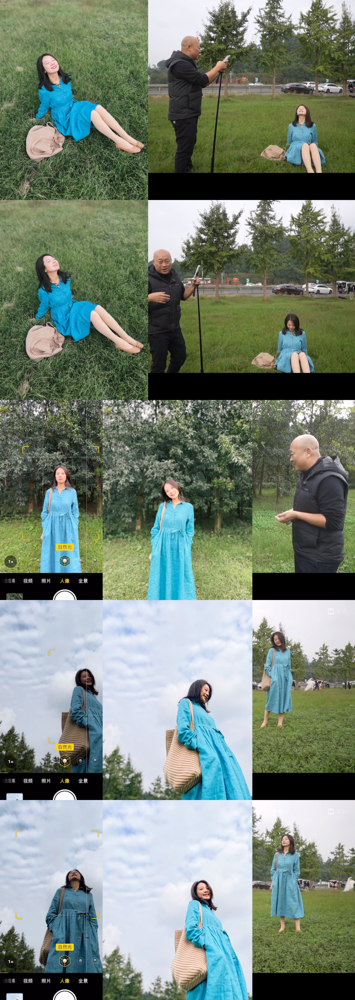
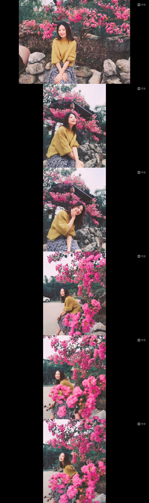

# 如何自拍

## 半身照和全身照怎么选

半身照适用场景：
- 地面杂乱
- 显得腿短的时候

## 把人拍高拍瘦

手机高度尽量在身体一半的位置以下

秘诀：
- 低角度或广角拍摄
- 头放在中间
- 上方留出大量空白
- 背景干净

## 正确使用手机镜头

广角适合大场景，比如天空、大海等。

## 自拍角度

- 俯拍
  - 拍草地
- 平拍
  - 垂直于天空，取到干净的背景
- 仰拍
  - 降低手机，用大面积的天空

