# 潘庆华摄影课程学习

## 构图

构图的意思就是这个拍摄对象在画面中的位置，决定了我们照片好不好看，看起来有没有感觉，所以构图很重要。

所谓「点构图」，是指拍摄主体在画面中占比较小，可以是单点也可以是多点，比如一株植物，等等

而根据焦点的位置，我们又可以把点构图分为中心点构图和三分点构图。

### 中心点构图

PS:主体位于网格线中心点位置，我们称之为中心点构图。

中心点构图能够突出主体、具有较强的画面形式感，缺点是画面容易呆板、沉闷。

注意：中心点构图常用于花卉、昆虫、建筑等相对静止的摄影题材👇

### 九宫格构图法

九宫格构图是需要将主体放在四个交点中的其一或者多个交点才是九宫格构图,网格线由两横两竖四条直线构成，直线的交点称为三分点.

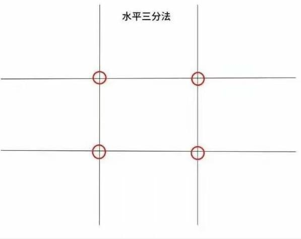

一般有两横两竖将画面均分，使用时将主体放置在线条四个交点上，或者放置在线条上。操作简单，表现鲜明，画面简练，很多相机上都直接配备有这个构图辅助线，应用广泛，多应用于风景、人像等。

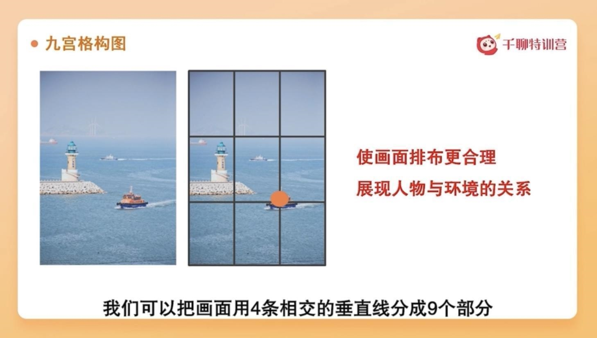

👆四个交点，三大块画面，人物站在三等分线上，这就是三分构图法

这张也是左三分线构图法，融入更多环境烘托主体,👆四个交点，三大块画面，或者可以将主体分别放在三分线和 焦点上，画面排布更加合理，这就是九宫格构图

相比于中心点构图，三分点构图会更加灵活。能更好的表达主体与背景的层次关系,所以，如果你是位不知道该怎么构图的摄影初学者，那么最稳妥的办法就是把“焦点”放在三分点上面。👇

### 倒影效果

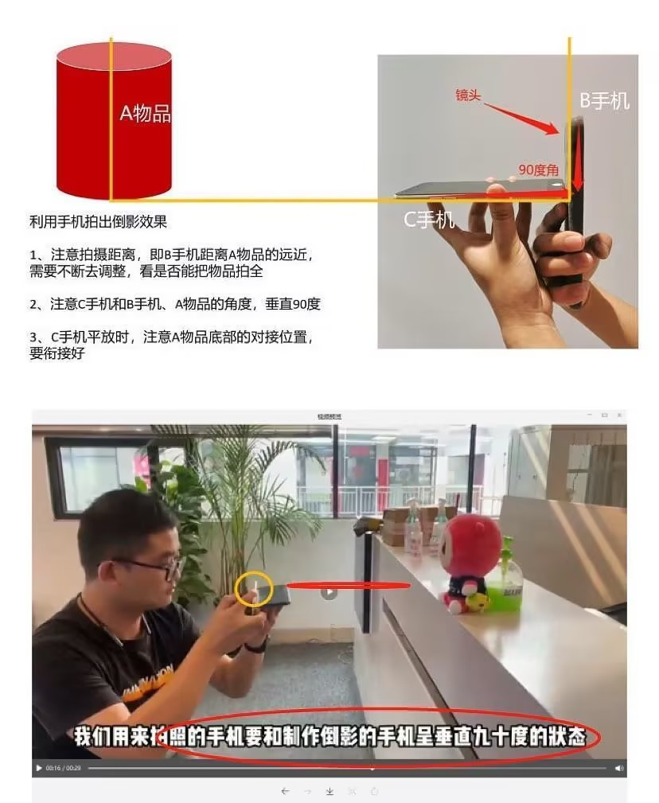

### 线构图

网格线有横线和竖线，最基本的功能是辅助我们拍摄时主体能够处于水平或垂直状态

### 对称线

对称构图会给人一种秩序、安静、平衡的视觉观感，在拍摄如建筑倒影的摄影题材中有广泛的运用.

### 对角线

虽然网格线中没有对角线，但学过初中数学都应该知道「两点一线」的道理。

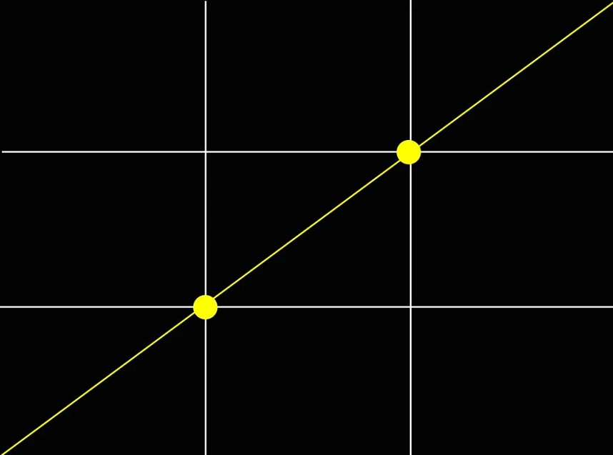

对角线构图能最大限度的利用画面的宽度，会呈现一种不稳定的画面状态。遇到有多个重复的物体时，利用对角线构图能让画面更加生动，而不至于呆板。👇

### 前景构图

利用近处的物体遮挡来进行拍摄，从而形成虚实对比和远近对比，让画面有空间感和层次感

## 修图

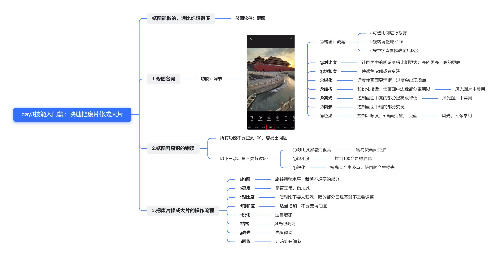

修图需要注意的点：
1. 使用裁剪功能时，需要可以用上不同的构图法则，长宽比例采用3：4或4：3
2. 无论调整什么功能，参数尽量不要超过50，除了【结构】
3. 【锐化】调节物体的内部结构，【结构】调整物体的外部结构

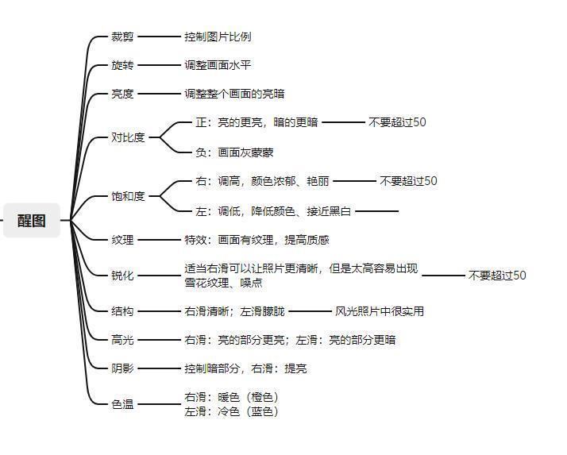

### 醒图操作说明

打开醒图之后点击导入照片，正下方调节按钮，然后点击构图，选择不同的内容，点击裁剪，可以自由裁剪，也可以按不同比例。

醒图编辑功能当中有16个工具，包括构图调整、局部、亮度、对比度、高光、阴影等等
- 构图：相当于裁剪，有二次构图的作用👇
- 醒图的局部调整：可以调整局部区域的亮度、对比度、饱和度、结构、光感、色温色调
- 智能优化：相当于一键优化调整，系统自动调节后期参数。
- 光感和亮度：都是调整画面明暗的参数，让画面变得更暗或更亮。
- 对比度：主要提升或降低画面亮部与暗部区域的明暗对比。
- 饱和度：调整画面色彩饱满度的参数，饱和度越高，画面色彩越鲜艳；饱和度越低，画面色彩越平淡
- 高光：主要是提升或降低高光区域的明亮度，它的调整只影响画面中最亮的高光区域。
- 阴影：这项参数主要是调整画面阴影区域的明亮度，它的调整只影响画面中最暗的阴影区域。
- 色温：调整画面冷暖色调的工具，降低色温，画面偏冷；提升色温，画面偏暖

### 注意点

使用的一些注意点：
- 使用裁剪功能时，可以用上不同的构图法则，裁剪要注意长宽比例采用3：4或4：3，如果实在不行的话，也可以自由裁剪
- 无论调整什么功能，参数尽量不要超过50
- 易错点：【锐化】调节物体的内部结构，【结构】调整物体的外部轮廓

### 参数说明

- 曝光：越高，画面整体会变亮，可以理解为只要是会发光的，层次都会被“放大”，太高会刺眼，太低感觉就会像蒙上一层灰

- 亮度：是色彩的明亮度，亮度最大，则是色彩最鲜艳的时刻！

- 鲜明度：针对于照片整体的一个明亮度，画面中色彩的饱和度，不会发生太大变化，可以理解为色彩的本质

- 高光：顾名思义，针对于画面中亮部的调整，暗部不会发生太大的一个变化

- 阴影：可以加深画面中的暗部，可以让对比更强，画面层次感更丰富
  
- 对比度：可以理解为，帮你同时让画面暗部更暗，亮部更亮，也是增加层次感
  
- 黑点：这个我理解为阴影差不多的
  
- 饱和度：调整色彩的饱和度，动一动，画面色彩变化明显
  
- 自然饱和度：也是调整画面色彩的一个饱和度，变化相对于饱和度，弱一点。有一个比较明显的区别，当把饱和度减到最低，画面会变成黑白，自然饱和度则还会保留一点色彩
  
- 色温：调整画面氛围，暖色和冷色，那些性冷淡风，冷色调必不可少
  
- 色调：调整画面中青色和红色，进而改变其他颜色
  
- 锐度：刻画画面中的细节，适当的调整，可以让画面看起来，更加的楞次分明
  
- 清晰度：理解为也是刻画细节的，配合锐度，画面整体上升不是一点点
  
- 晕影：有点像背景虚化，不过是圆形的  
  
### 游客照摄影小技巧

### 长焦和广角很好用

广角镜头的特点是：越靠近画面中心，对象显得越小；越靠近画面边缘，对象会被拉长。所以，想要拍出瘦脸、大长腿的照片，使用超广角就超级重要。

### 不像游客照的构图

翻看手机相册时，最常见的照片大概就是这类旅游纪念照了。有景有人，人与景占比1:1，是特别标准的游客照。

当然啦！并不是说这样拍不行。只是我们都希望旅拍照片在留念的基础上，还能拍得更“有范儿”。从构图的角度，可以尝试以下两种调整方式。

- 以人为主。让人物在画面中占比更多，更加突出“人像”。拍摄的时候，把人物做为主体放在居中构图，并且尝试换个角度~会更加突出😉

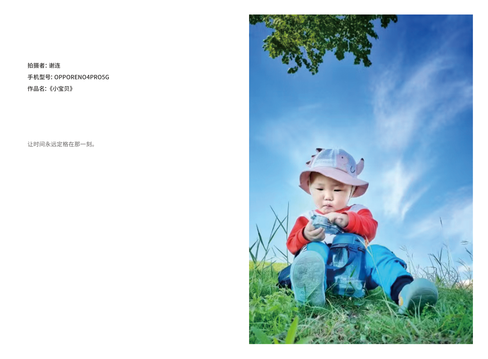

- 人融于景。让景在画面中占比更多，将照片拍成“环境人像”👇
  

#### 利用好各种光

你一定有过这样的体验:天气晴朗的日子，太阳光直射下来，影子非常清晰；而多云阴天的日子，太阳光被大气反射和散射，影子就不太明显。这两种光线在画面上带给我们的感受，有“硬”与“软”的区别。

硬光有很强烈的“塑形”作用，会对照片构图产生直接影响。如果应用巧妙，将是照片的点睛之笔。

而太阳落山前后的几分钟里，特别适合呈现女生柔和的面庞。

#### 表现自然就是最好的拍照姿势

摆姿势这件事，没有最好，只有最适合。不过有一点毋庸置疑，那就是 自然的姿势通常效果更好。不过如果你一面对镜头就范尴尬癌，这里有一些小建议。

- 首先，一看镜头就紧张?那就索性不看！这个方法简单易学又好用。
- 其次，我们可以做“小动作”。捂眼睛、抚弄头发、扶眼镜，这些不起眼的“小动作”，既能让整个人放松下来，又能让画面灵动起来。
  

#### 拍摄剪影游客照

旅游途中拍摄剪影，也能让照片充满艺术感，最适合的时间是清晨和黄昏之时，背景与摄影对象的颜色对比和明暗对比强烈，因此，剪影的效果会更加明显。一定要避开杂乱的背景，选择简洁的地方，如湖泊、空旷的高地。

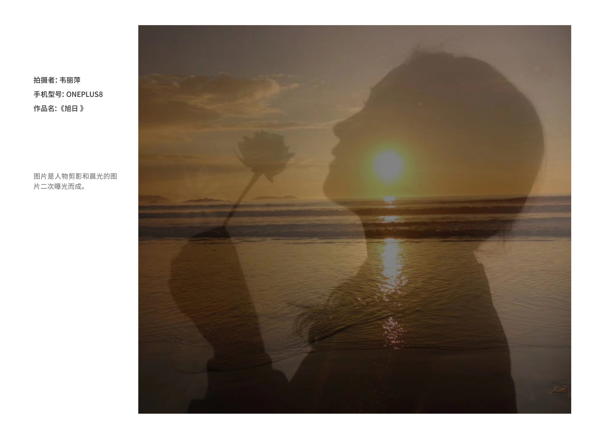

不要把太阳等光源作为测光点，这样光源会特别刺眼，画面大幅度惨白，要将测光点放在太阳周围的区域。并尝试将焦点放在主体上。我们要降低曝光就用手指点击屏幕把小太阳往下拉就可以

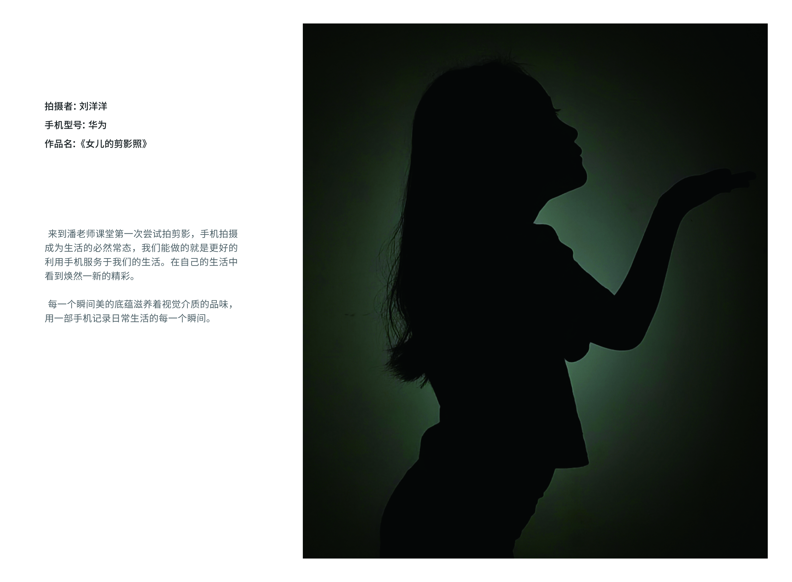

### 修图思路

第一. 分析自己拍的照片，这一步至关重要，因为当我们拍照时，往往会受到设配、光线、色彩等客观问题的影响，从而使我们拍出的照片或多或少都存在各种问题。以下面的照片举例

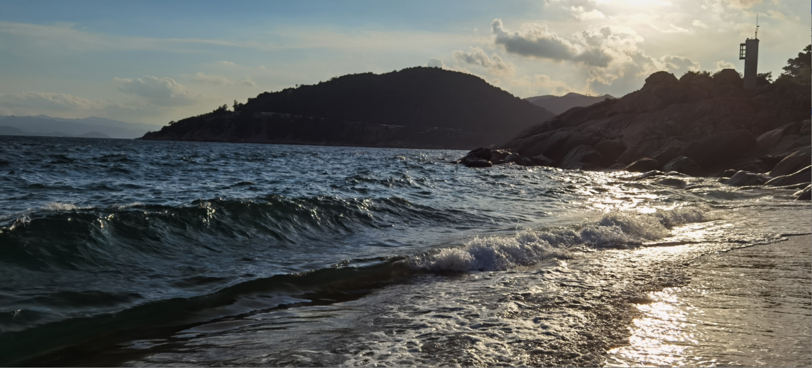

存在问题：
1. 弱光环境拍摄，导致亮度偏低，曝光不足
2. 对比度较低，明暗层次不够突出
3. 色彩还原度较低，比较暗淡

通过对照片的分析，其存在问题我们已经有了大致了解，这为我们接下来的修图提供了相对明确的调整方向.

第二, 根据问题进行针对性修整:

问题1: 亮度偏低，曝光不足

调整照片亮度及曝光，我们可以找到修改选项中的“亮度或曝光度”选项进行调节

问题2：对比度较低，明暗层次不够突出

调高选项中“对比度”参数，使画面暗部份暗下去，亮部分亮起来。通过强烈的明暗对比使画面层次分明。

问题3： 色彩还原度较低

找到调整选项中“饱和度”选项，适当调高参数至你认为合适的程度，使颜色还原更贴近于真实。

最终成品：

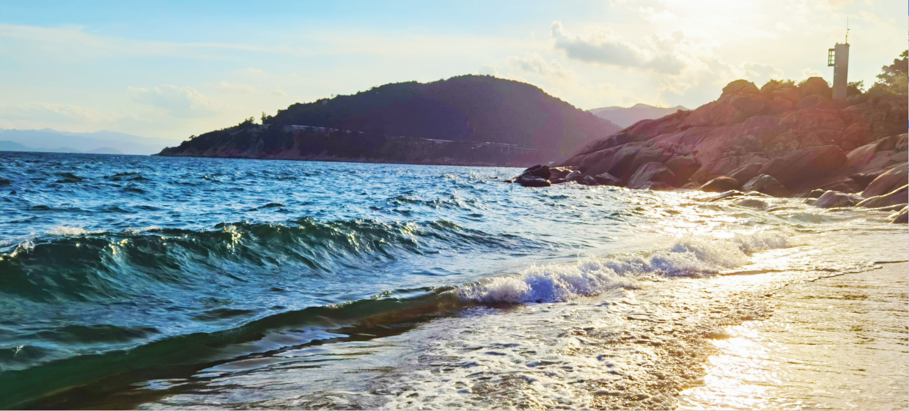

## 直播课

拍摄原则：主题突出、配体辅助，去掉一切无关内容，背景简洁

#### 美食类参考
1. 光线好
2. 背景选择深色不反光
3. 一前一后布局，突出前面的主体，虚化后面陪体
4. 搭配具有相关性（咖啡与花、美食与餐具有相关性）
5. 虚化背景（开启人像模式、大光圈模式）

#### 黑背景教程

1. 关闭所有灯光，只留小台灯光照亮拍摄主体
2. 主体亮度高于背景（避开比主体亮的背景）
3. 点击对焦最亮的部位向下拉小太阳，直到背景变黑

### 拍摄思路总结

对焦、曝光调整、构图和修图，一起运用~思路如下👇：
- ✨第一步：明确主体
- ✨第二步：选择合适的光线
- ✨第三步：确立合适的背景
- ✨第四步：搭配合理的道具
- ✨第五步：选择合理的角度
- ✨第六步：确立构图的思路